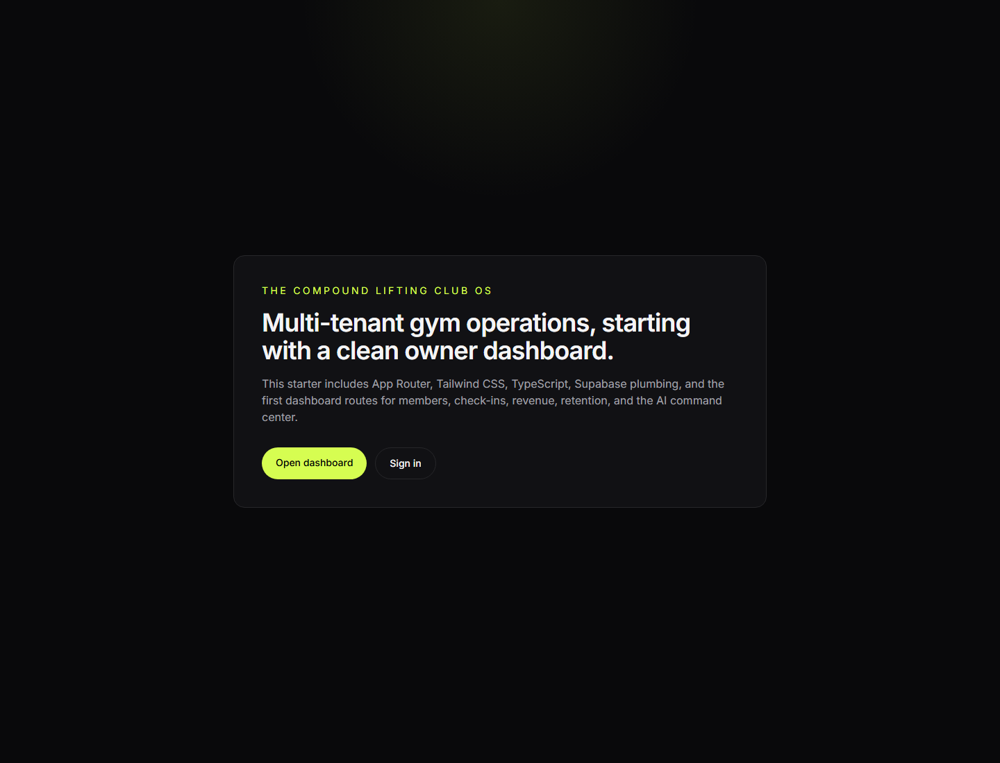
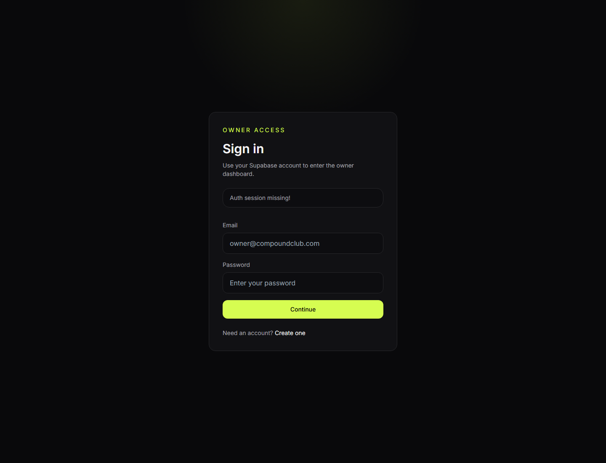

# Compound OS

Multi-tenant gym and studio operating system built with Next.js, TypeScript, Supabase, Stripe, and an Expo member app.

Compound OS is a product experiment around one question:

`What would gym software look like if it understood operations, member experience, retention, culture, payments, and staff workflows in one place?`

## Why I Am Building This

I have spent time around gyms, operators, service businesses, and people trying to manage real-world customer relationships with scattered tools.

Most gym software solves pieces of the problem:

- admin records
- billing
- check-ins
- scheduling
- member communication

Compound OS is being built as a more complete operating layer for gyms and studios: owner dashboard, staff workflows, member app, retention signals, culture features, and AI-assisted operations.

This is also one of my main portfolio projects as I move toward full-stack and startup roles.

## Current Status

This is an early-stage build. The current priority is proving product direction and workflow structure.

Current focus:

- owner dashboard
- member management
- check-ins
- retention signals
- revenue and billing workflows
- AI command center
- member mobile app
- Supabase schema and migrations
- production hardening docs

The UI is still in testing and will receive a full polish pass after the core workflows are stable.

## Screenshots





## Stack

- Web app: Next.js App Router, React, TypeScript, Tailwind CSS
- Backend/data: Supabase Auth, Postgres, Row Level Security
- Mobile app: Expo, React Native, TypeScript
- Payments: Stripe Connect, Stripe Checkout, webhooks
- AI: OpenAI-powered or rule-based operational insights

## What Is Implemented Or In Progress

- Next.js owner web app
- protected owner dashboard routes
- Supabase auth direction
- member management workflows
- check-in workflows
- revenue and billing direction
- retention and follow-up concepts
- AI command center direction
- Expo member app workspace
- Supabase migrations
- production hardening documentation
- deployment and observability planning

## Product Areas

### Owner Dashboard

The owner dashboard is designed to give gym operators a command center for member health, check-ins, billing, culture, and operational tasks.

### Member App

The member app is designed to feel like a premium gym companion, not just a watered-down billing portal.

Planned/active directions:

- QR check-in
- profile
- workouts
- coaching
- community
- gym news
- wallet/payment direction

### AI Command Center

The AI layer is meant to support staff and owners with practical next actions.

Examples:

- identify members at risk of churn
- suggest follow-up tasks
- summarize operational issues
- surface billing or attendance anomalies

## Technical Direction

Compound OS is being built as a real SaaS-style product, not a static demo.

Key technical concerns:

- multi-tenant data boundaries
- auth and permissions
- row-level security
- payment lifecycle reliability
- operational auditability
- mobile and web coordination
- stable deployment process

## Docs

- [Product roadmap](docs/product-roadmap.md)
- [Information architecture](docs/information-architecture.md)
- [Production hardening](docs/production-hardening.md)
- [Observability and alerting](docs/observability-and-alerting.md)
- [Backup and recovery playbook](docs/backup-and-recovery-playbook.md)
- [Deployment runbook](docs/deployment-runbook.md)
- [Payment chaos testing](docs/payment-chaos-testing.md)
- [Native mobile release runbook](docs/native-mobile-release-runbook.md)

## Run Locally

```bash
npm install
npm run dev
```

Open:

```text
http://localhost:3000
```

For the member app:

```bash
cd member-app
npm install
npm run start
```

## Environment Variables

Create `.env.local` from `.env.example`.

Required areas:

- Supabase URL and anon key
- Supabase service role key
- Stripe keys
- OpenAI key, optional for AI workflows
- public app URL

Do not commit real secrets.

## What This Project Shows

- full-stack product thinking
- SaaS architecture
- database and auth direction
- payment workflow awareness
- mobile app direction
- operator empathy
- technical documentation
- ability to turn real-world operations into software

## Next Steps

- finish public demo path
- add more polished screenshots
- deploy demo environment
- tighten README with live URLs
- record short walkthrough video
- continue member app workflow polish
- add more testable workflow proof
